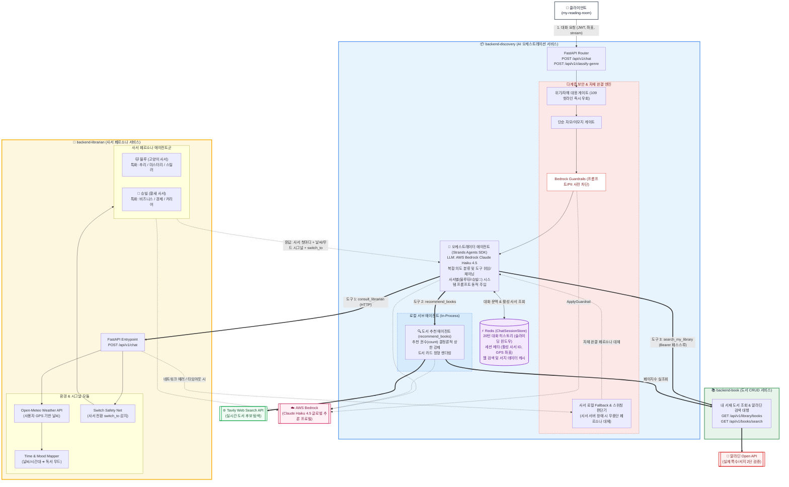
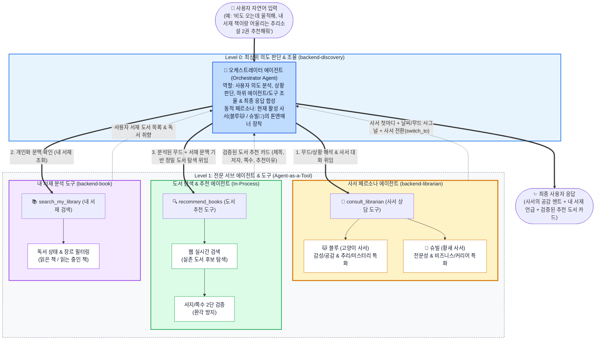
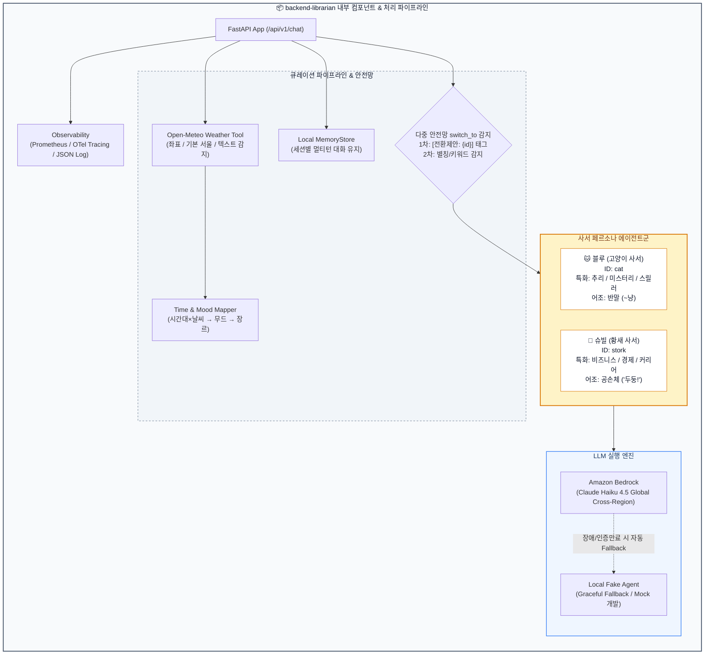

# backend-librarian

동물 사서 캐릭터가 날씨/시간대/장르에 어울리는 책을 추천하는 백엔드 에이전트

## 개요

MSA 구조의 "Don't Paw-get Your Book" 프로젝트에서 **캐릭터 페르소나 + 큐레이션 오케스트레이션** 레이어를 담당합니다.

- **고양이 사서 (블루)**: 친근한 반말(~냥) 말투. 전 장르 추천 가능하며 **미스터리·추리·탐정·스릴러**에 특화되어 더 깊이 있게 추천 및 상담
- **황새 사서 (슈빌)**: 차분하고 정중한 존댓말(공손체 '두둥!'). 전 장르 추천 가능하며 **비즈니스·경영·경제·투자·커리어**에 특화되어 더 깊이 있게 추천 및 상담
- **공통 도구**: 두 사서 모두 실시간 날씨(Open-Meteo)와 시간대를 활용하여 상황과 분위기에 맞는 큐레이션을 제공합니다.
- **다중 안전망 스위칭**: 질문 인텐트(비즈니스 ↔ 미스터리) 또는 사서 호출 시 `switch_to` 제안을 통해 상호 전환을 안내합니다.

## 🏛️ 시스템 아키텍처 & 에이전트 토폴로지

### 1. 시스템 통합 아키텍처 (마이크로서비스 & 인프라 뷰)
디스커버리 오케스트레이터(`backend-discovery`)와 사서 에이전트(`backend-librarian`), 도서 CRUD(`backend-book`) 및 외부 연동의 전체 물리/네트워크 구성입니다.



---

### 2. 순수 에이전트 토폴로지 (Agent-as-a-Tool 뷰)
오케스트레이터와 사서 에이전트 간의 계층적 역할 분담 및 도구 호출 흐름을 나타낸 다이어그램입니다.



---

### 3. backend-librarian 내부 상세 파이프라인



## 기술 스택

| 계층 | 기술 |
|---|---|
| Language & Runtime | Python 3.14 / 3.13+, uv 패키지 매니저 |
| Agent Framework | Strands Agents SDK |
| Model | Amazon Bedrock (Claude Haiku 4.5 - `global.anthropic.claude-haiku-4-5-20251001-v1:0`) |
| Fallback Engine | Local Fake Agent (역할 기반 결정론적 라우팅 & 무중단 서빙) |
| 날씨 API | Open-Meteo (무키, 강수 정밀 감지) |
| Web Framework | FastAPI + Uvicorn (HTTP / text-event Streaming) |
| Observability | Prometheus (`/actuator/prometheus`), OpenTelemetry (OTLP), Structured JSON Logging |
| Testing & Lint | pytest (226 tests, 100% pass), ruff |

## 저장소 구조

```text
backend-librarian/
├── app/librarian/
│   ├── main.py              # handle_chat 오케스트레이션 엔트리포인트 (signals & switch_to 다중 안전망)
│   ├── server.py            # FastAPI 서버 (mock/bedrock 전환, CORS, X-Signals 헤더, OTel/Prometheus 마운트)
│   ├── agent.py             # Strands Agent 빌더 (Bedrock 연동 및 추적 설정)
│   ├── bedrock_agent.py     # 실제 Bedrock LLM 호출 + 프롬프트 조립 + fake graceful fallback
│   ├── fake_agent.py        # fake 에이전트 (역할 기반 결정론적 라우팅)
│   ├── schemas.py           # 요청/응답 Pydantic 스키마 (LibrarianSignals, SwitchTo)
│   ├── librarians.py        # 사서 레지스트리 (블루/슈빌 메타데이터)
│   ├── personas/
│   │   ├── base.py          # 공통 프롬프트 규칙
│   │   ├── cat.py           # 고양이 사서(블루) 시스템 프롬프트
│   │   └── stork.py         # 황새 사서(슈빌) 시스템 프롬프트
│   ├── curation/
│   │   └── mood.py          # 시간대×날씨 → 무드 → 장르 매핑
│   ├── tools/
│   │   └── weather.py       # Open-Meteo 날씨 조회 및 강수 감지
│   ├── memory/
│   │   ├── base.py          # MemoryStore 인터페이스
│   │   └── local.py         # 인메모리 구현
│   └── observability/
│       ├── logging_setup.py # 구조화 JSON 로깅 및 PII/LLM 원문 마스킹
│       ├── metrics.py       # Prometheus Micrometer 호환 메트릭
│       └── tracing.py       # OTel 트레이서 설정 및 httpx/Bedrock 계측
├── docs/
│   ├── INTEGRATION_MANUAL.md # 사서 연동 & 아키텍처 상세 명세서
│   └── observability-notes.md# 관측 가능성 설계 노트
├── k8s/                     # Kubernetes Kustomize 배포 매니페스트 (base, overlays/dev)
├── tests/                   # 226 tests (100% passed)
├── scripts/
│   ├── run_server.sh        # 서버 실행 (--host 0.0.0.0, 외부 접속용)
│   ├── mfa_session.py       # MFA 세션 자격증명 발급
│   ├── smoke_bedrock_chat.py # Bedrock end-to-end 스모크
│   └── verify_bedrock_mfa.py # 모델/리전 접근 진단
├── pyproject.toml
└── uv.lock
```

## 실행 방법

### 환경 준비

```bash
uv sync --frozen
```

### fake 모드 (AWS 불필요, 로컬 기본 개발용)

```bash
uv run uvicorn app.librarian.server:app --reload --port 8000
```

### Bedrock 모드 (Claude Haiku 4.5 실서비스)

```bash
# 1. MFA 세션 발급 (12시간 유효)
uv run python scripts/mfa_session.py <MFA 6자리 코드>

# 2. 서버 실행
USE_BEDROCK=true AWS_PROFILE=mfa uv run uvicorn app.librarian.server:app --reload --port 8000
```

### 외부(오케스트레이터/다른 기기)에서 접속해야 할 때

기본값(`127.0.0.1`)은 **내 컴퓨터에서만** 접근됩니다. 오케스트레이터가 다른 기기(예: 팀원 맥북, 클러스터)에서 이 서버로 요청을 보내야 하면 **반드시 `--host 0.0.0.0`** 을 붙여 모든 인터페이스에 바인딩해야 합니다.

```bash
USE_BEDROCK=true AWS_PROFILE=mfa uv run uvicorn app.librarian.server:app --host 0.0.0.0 --port 8000 --reload
```

편의 스크립트로도 실행할 수 있습니다 (`--host 0.0.0.0 --port 8000` 기본 포함):

```bash
# fake 모드
bash scripts/run_server.sh

# Bedrock 모드
USE_BEDROCK=true AWS_PROFILE=mfa bash scripts/run_server.sh
```

### 헬스체크

```bash
curl http://localhost:8000/api/v1/health
# → {"status": "ok", "mode": "mock"} 또는 {"status": "ok", "mode": "bedrock"}
```

## API 계약

### POST /api/v1/chat (별칭: /chat)

**요청 (ChatRequest):**
```json
{
  "message": "SF 소설 추천해줘",
  "librarian_id": "cat",
  "session_id": "optional-session-id",
  "stream": false,
  "latitude": 37.5665,
  "longitude": 126.9780
}
```

| 필드 | 필수 | 기본값 | 설명 |
|---|---|---|---|
| message | O | - | 사용자 메시지 (1~2000자) |
| librarian_id | X | "cat" | 현재 사서 선택 ("cat" / "stork") |
| session_id | X | 자동 생성 | 멀티턴 대화 유지용 UUID |
| stream | X | false | true면 text/plain 스트리밍 응답 |
| latitude/longitude | X | 37.5665, 126.9780 | 날씨 조회용 위도/경도 (생략 시 서울 기본값) |

**응답 (ChatResponse, stream=false):**
```json
{
  "message": "비즈니스나 경영, 경제 관련 전문 지식은 우리 황새 사서 슈빌이 훨씬 더 해박하고 깊이 있는 통찰을 준다냥! 🪿\n\n슈빌한테 가면 훨씬 더 자세하고 전문적으로 알려줄 거다냥!\n\n내가 황새 사서한테 연결해줄게냥~ 😺",
  "session_id": "sess-1234-abcd",
  "text": "비즈니스나 경영, 경제 관련 전문 지식은 우리 황새 사서 슈빌이 훨씬 더 해박하고 깊이 있는 통찰을 준다냥! 🪿\n\n슈빌한테 가면 훨씬 더 자세하고 전문적으로 알려줄 거다냥!\n\n내가 황새 사서한테 연결해줄게냥~ 😺",
  "librarian_id": "cat",
  "switch_to": {
    "id": "stork",
    "name": "황새 사서",
    "icon": "🪿",
    "genres": ["비즈니스", "경영", "경제", "투자", "자기계발", "SF", "과학", "역사"],
    "reason": "황새 사서 전문 분야 추천"
  },
  "signals": {
    "weather": {
      "weather": "맑음",
      "condition": "clear",
      "temperature": 27.5,
      "is_rainy": false,
      "description": "맑음",
      "location_source": "user"
    },
    "time_of_day": "day",
    "mood": "adventurous",
    "genre_focus": ["판타지", "SF", "여행", "모험"]
  }
}
```

**응답 (stream=true):**
- `Content-Type`: `text/plain; charset=utf-8` (본문은 텍스트 청크 스트리밍)
- 헤더: `X-Session-Id`, `X-Librarian-Id`, `X-Switch-To` (전환 시), `X-Signals` (날씨/무드 JSON 문자열)

## 사서 페르소나 및 스위칭 규칙

| 사서 | 이름 | 말투 | 특화 주제 | 기본 추천 범위 | switch_to 전환 제안 조건 |
|---|---|---|---|---|---|
| **cat (고양이)** | 블루 | 친근한 반말, 문장 끝 "~냥" | 🔍 미스터리·추리·탐정·스릴러 | 전 장르 100% 추천 가능 | 비즈니스/경영/경제 심층 질문 또는 "황새", "슈빌" 호칭 시 ➔ `stork` 제안 |
| **stork (황새)** | 슈빌 | 차분하고 정중한 존댓말 (공손체 '두둥!'), 추임새 '두둥!'/'두둥...' | 📈 비즈니스·경영·경제·투자 | 전 장르 100% 추천 가능 | 미스터리/추리 심층 질문 또는 "고양이", "블루" 호칭 시 ➔ `cat` 제안 |

### signals (날씨/무드/장르 시그널)

```json
"signals": {
  "weather": {
    "weather": "맑음",
    "condition": "clear",
    "temperature": 27.5,
    "is_rainy": false,
    "description": "맑음",
    "location_source": "user"
  },
  "time_of_day": "day",
  "mood": "adventurous",
  "genre_focus": ["판타지", "SF", "여행", "모험"]
}
```

**location_source** (UI 신뢰도 표시용):
- `user`: 사용자가 보낸 실제 GPS 좌표로 실시간 조회
- `default_seoul`: 좌표 누락 시 서울 기본값으로 조회
- `text_stated`: 사용자가 메시지 본문에 날씨를 직접 언급한 경우 ("비 오는 날 읽기 좋은 책")
- `none`: 날씨 정보 미제공 (시간대 기반 큐레이션 적용)

## 검증 및 린트

```bash
uv run ruff check .
uv run pytest -q
# 226 passed in 3.35s
```

## 환경 변수

| 변수 | 용도 | 기본값 |
|---|---|---|
| USE_BEDROCK | true면 Bedrock 호출, 미설정이면 fake 에이전트 | 미설정(mock) |
| AWS_PROFILE | MFA 세션 프로필 | - |
| AWS_REGION | Bedrock 리전 | ap-northeast-2 |
| BEDROCK_MODEL_ID | Bedrock 모델 ID (크로스리전 inference profile) | global.anthropic.claude-haiku-4-5-20251001-v1:0 |
| OTEL_SERVICE_NAME | 트레이스/로그의 서비스 이름 및 Prometheus의 `application` 라벨 | backend-librarian |
| OTEL_EXPORTER_OTLP_ENDPOINT | OTLP HTTP Collector 엔드포인트 (설정 시 트레이스 전송 활성화) | 미설정(exporter 비활성화) |
| OTEL_EXPORTER_OTLP_PROTOCOL | OTLP 전송 프로토콜 (Collector는 `http/protobuf` + 4318) | http/protobuf |
| OTEL_TRACES_SAMPLER_ARG | 트레이스 샘플링 비율 (0.0~1.0) | 1.0 |
| LOG_LEVEL | 루트 로거 레벨 | INFO |

## 📊 관측 가능성 (Observability)

- **메트릭**: Prometheus (`/actuator/prometheus`) - Spring Boot Micrometer 호환 규격으로 HTTP 요청 지연/에러율 수집 (`ServiceMonitor` 30초 스크레이핑)
- **트레이싱**: OpenTelemetry (OTLP) - W3C `traceparent` 헤더 전파로 디스커버리(`backend-discovery`) 연동 분산 추적 (Grafana Tempo)
- **로깅**: 구조화 JSON 로깅 (Grafana Alloy + Loki 수집, PII 및 LLM 원문 `[REDACTED]` 마스킹)

> 세부 인프라 연동 규격 및 구현 한계점은 [`docs/observability-notes.md`](docs/observability-notes.md)를 참고하세요.

---

## 🚀 CI / CD 파이프라인

- **CI (지속적 통합)**:
  - `pr-convention-check.yml`: PR 제목/본문 컨벤션(`[CLIAR-XX]`) 자동 검증
  - 코드 품질 검증: PR 생성 전 `ruff check`, `pytest`를 통한 린트 및 단위 테스트 사전 검증
- **CD (지속적 배포)**:
  - `build-push-ecr.yml`: `develop` 브랜치 병합 시 AWS ECR 컨테이너 이미지 자동 빌드 및 푸시
  - **GitOps 배포**: Kustomize 이미지 태그 자동 갱신 ➔ ArgoCD가 EKS `dev` 네임스페이스에 무중단 롤링 업데이트 배포
  - **K8s 인프라 연동**: `ServiceMonitor`를 통한 Prometheus 메트릭 자동 수집 및 OTel Collector(4318) 엔드포인트 자동 주입


