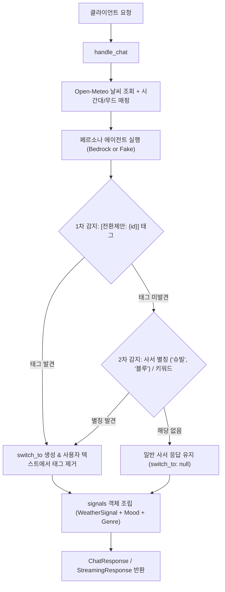

# 📚 사서 에이전트(backend-librarian) 연동 & 아키텍처 명세서

본 문서는 사서 에이전트 서비스(`backend-librarian`), 오케스트레이터(`backend-discovery`), 그리고 프론트엔드(`frontend`) 간의 인터페이스 계약, 사서 캐릭터 페르소나 정의, `signals` 및 `switch_to` 다중 안전망 아키텍처, 그리고 연동 장애 시의 트러블슈팅 가이드를 집대성한 공식 문서입니다.

---

## 1. 사서 캐릭터 정체성 및 역할 분담 (공식 정의)

프론트엔드 및 기획 기준에 맞추어 사서의 말투, 성격, 특화 영역 및 전환 규칙이 다음과 같이 확정되었습니다:

| 구분 | 🐱 고양이 사서 (블루) | 🪿 황새 사서 (슈빌) |
|---|---|---|
| **이름** | **블루** (Russian Blue) | **슈빌** (Shoebill) |
| **말투 / 어조** | **친근한 반말**, 문장 끝 **"~냥"** | **차분하고 정중한 존댓말 (공손체 '두둥!')**, 시그니처 추임새 `두둥!/두둥...`, `~답니다/이지요/드립니다` |
| **성격** | 친근하고 사교적, 호기심 많고 활발함 | 차분하고 정중함, 깊은 통찰을 지닌 현자 |
| **특화 주제 (Specialty)** | **🔍 미스터리 / 추리 / 탐정 / 스릴러 (Mystery)** | **📈 비즈니스 / 경영 / 경제 / 투자 / 커리어 (Business)** |
| **기본 추천 범위** | 모든 일반 장르(소설, 에세이, 시, 힐링 등) 추천 가능 | 모든 일반 장르(SF, 역사, 과학, 인문학 등) 추천 가능 |
| **공통 도구 (날씨/시간/기분)** | **실시간 날씨 & 시간대 & 기분 적극 활용** (반말로 친근하게 녹여냄) | **실시간 날씨 & 시간대 & 기분 적극 활용** (존댓말로 지적이고 차분하게 녹여냄) |
| **`switch_to` 전환 제안 트리거** | **비즈니스(Business), 경영, 경제, 투자, 스타트업** 질문 또는 *"슈빌"*, *"황새"* 호칭 시 ➔ `stork` 제안 | **미스터리(Mystery), 추리, 탐정, 트릭, 스릴러** 질문 또는 *"블루"*, *"고양이"* 호칭 시 ➔ `cat` 제안 |
| **전환 제안 안내 예시** | *"비즈니스나 경영, 경제 쪽은 우리 황새 사서 슈빌이 특화되어 훨씬 더 깊이 있게 잘 알려준다냥! 🪿"* | *"두둥! 미스터리와 추리 소설의 짜릿한 매력은 우리 고양이 사서 블루가 특화되어 훨씬 더 흥미진진하게 잘 알려준답니다 🐱"* |

---

## 2. API 계약 및 DTO 구조 (`POST /api/v1/chat`)

### 1) 요청 스키마 (`ChatRequest`)

```json
{
  "message": "SF 소설 추천해줘",
  "librarian_id": "cat",
  "session_id": "sess-1234-abcd",
  "stream": false,
  "latitude": 37.5665,
  "longitude": 126.9780
}
```

* `message` (필수, 1~2000자): 사용자 질의 메시지
* `librarian_id` (선택, 기본값 `"cat"`): 대화 대상 사서 (`"cat"` 또는 `"stork"`)
* `session_id` (선택): 멀티턴 세션 ID (생략 시 서버에서 UUIDv4 자동 생성)
* `stream` (선택, 기본값 `false`): `true`일 경우 `text/plain` 스트리밍 응답
* `latitude` / `longitude` (선택): 사용자 GPS 좌표 (생략 시 서울 `37.5665, 126.9780` 기본값으로 두 사서 모두 날씨 혜택)

### 2) 응답 스키마 (`ChatResponse`)

```json
{
  "message": "경영이나 SF/과학, 역사 같은 깊이 있는 전문 지식은 우리 황새 사서 슈빌이 훨씬 더 해박하다냥! 🪿\n\n슈빌에게 연결해줄게냥~ 😺",
  "session_id": "sess-1234-abcd",
  "text": "경영이나 SF/과학, 역사 같은 깊이 있는 전문 지식은 우리 황새 사서 슈빌이 훨씬 더 해박하다냥! 🪿\n\n슈빌에게 연결해줄게냥~ 😺",
  "librarian_id": "cat",
  "switch_to": {
    "id": "stork",
    "name": "황새 사서",
    "icon": "🪿",
    "genres": ["SF", "판타지", "과학", "역사", "비즈니스", "경영", "경제", "스릴러", "추리"],
    "reason": "황새 사서 전문 분야 추천"
  },
  "signals": {
    "weather": {
      "weather": "맑음",
      "condition": "clear",
      "temperature": 27.5,
      "is_rainy": false,
      "description": "맑음",
      "location_source": "user"
    },
    "time_of_day": "day",
    "mood": "adventurous",
    "genre_focus": ["판타지", "SF", "여행", "모험"]
  }
}
```

### 3) 스트리밍 응답 헤더 (`stream=true`)
* `Content-Type`: `text/plain; charset=utf-8`
* `X-Session-Id`: 세션 식별자
* `X-Librarian-Id`: 응답 사서 ID (`cat` / `stork`)
* `X-Switch-To`: 사서 전환 제안 JSON 문자열
* `X-Signals`: 날씨/무드/장르 시그널 JSON 문자열

---

## 3. 핵심 아키텍처 및 다중 안전망 설계



1. **결정론적 `switch_to` 다중 안전망**:
   * **1차 (명시적 구조화 태그)**: 시스템 프롬프트에 전환 필요 시 `[전환제안: stork]` 또는 `[전환제안: cat]`을 출력하도록 지시. 수신 시 태그를 파싱하여 `switch_to` 객체를 만들고 사용자 노출 텍스트에서는 깔끔하게 제거.
   * **2차 (별칭 매칭 보조망)**: LLM이 태그를 누락하더라도 `"슈빌"`, `"하루"`, `"황새"`, `"블루"`, `"나비"` 등의 사서 호칭/별칭을 감지하여 스위칭 복구.
2. **Bedrock 에러 시 Graceful Fallback**:
   * AWS MFA 세션 만료, 네트워크 장애 등으로 Bedrock 호출이 실패할 때, 200 OK로 에러 문구(`"생각이 안 난다냥..."`)를 반환하여 Discovery를 속이는 Silent Failure를 제거.
   * 상세 진단 로그(`_log_agent_failure`)를 남기고 로컬 [`fake_agent.py`](file:///Users/jangchangho/backend-librarian/app/librarian/fake_agent.py)로 매끄럽게 fallback하여 무중단 서비스 제공.
3. **`signals` 응답 100% 보장**:
   * 두 사서 모두 날씨 프로바이더를 경유하여 계산된 `weather`, `time_of_day`, `mood`, `genre_focus`를 패키징하여 오케스트레이터의 도서 검색 및 프론트엔드의 `WeatherMoodBadge` 뱃지로 온전히 전달.

### 3.1 오케스트레이터(Discovery) 통합용 Mermaid 서브그래프 가이드

디스커버리 레포지토리나 AI 어시스턴트(agy)가 전체 서비스 토폴로지를 단일 Mermaid 다이어그램으로 시각화할 때, 아래의 `subgraph LibrarianRepo` 코드 블록을 그대로 포함하여 레포 경계 및 내부 에이전트를 구분할 수 있습니다:

```mermaid
subgraph LibrarianRepo["📦 backend-librarian (사서 서비스)"]
    direction TB
    L_API["FastAPI Entrypoint (/api/v1/chat)"]
    
    subgraph Librarians["사서 페르소나 에이전트군"]
        direction LR
        Cat["🐱 블루 (고양이 사서)<br/>• ID: cat<br/>• 특화: 추리 / 미스터리 / 스릴러"]
        Stork["🪿 슈빌 (황새 사서)<br/>• ID: stork<br/>• 특화: 비즈니스 / 경제 / 커리어"]
    end

    subgraph InternalEngine["큐레이션 엔진 & 도구"]
        Weather["Open-Meteo Weather API"]
        Mood["Time & Mood Mapper"]
        Safety["Switch Safety Net (전환 감지)"]
    end

    L_API --> Safety
    Safety --> Librarians
    L_API --> Weather --> Mood
end

%% 디스커버리 오케스트레이터와의 인터페이스 연결 가이드 (Discovery 측에서 합성)
%% DiscoveryOrchestrator -->|HTTP POST /api/v1/chat| L_API
%% Cat -.->|switch_to: stork 제안| DiscoveryOrchestrator
%% Stork -.->|switch_to: cat 제안| DiscoveryOrchestrator
```

---

## 4. 연동 시 문제 해결 가이드 (Troubleshooting)

연동 중 발생할 수 있는 주요 증상과 해결 절차입니다:

| 증상 | 원인 점검 | 해결 조치 |
|---|---|---|
| **고양이에게 SF/경영을 물어봐도 슈빌 전환 버튼이 안 뜸** | 1. 사서 서버 응답에 `switch_to`가 `null`인지 확인<br>2. 오케스트레이터가 `switch_to`를 프론트로 패스스루하는지 확인 | 1. `backend-librarian`의 `handle_chat`에서 `_detect_stork_intent` 키워드 분기 확인<br>2. `backend-discovery`의 `ConsultLibrarianTool` 로컬 fallback 정합성 확인 |
| **"슈빌 사서"라고만 쳤는데 뜬금없이 책 목록 카드가 출력됨** | 오케스트레이터 프롬프트가 모든 입력에 대해 `recommend_books` 연쇄 호출을 강제하고 있음 | `backend-discovery`의 [`agent.py`](file:///Users/jangchangho/backend-discovery/src/discovery/domain/orchestrator/agent.py) 프롬프트에서 단순 호칭/인사 시 `consult_librarian`만 호출하도록 인텐트 분기 확인 |
| **프론트엔드 상단 날씨 뱃지가 표시되지 않음** | 사서 응답 또는 오케스트레이터 스트리밍 헤더에 `X-Signals` (또는 JSON `signals`) 누락 | 1. 사서 서버 응답의 `signals` 객체 유무 확인<br>2. CORS `expose_headers`에 `X-Signals` 포함 여부 확인 |
| **Bedrock 모드 기동 시 응답이 지연되거나 실패** | AWS MFA 토큰 만료 또는 AWS 프로필 미설정 | 터미널에서 `uv run python scripts/mfa_session.py <MFA코드>` 재발급 후 `USE_BEDROCK=true AWS_PROFILE=mfa uv run uvicorn app.librarian.server:app --reload` 재실행 |
